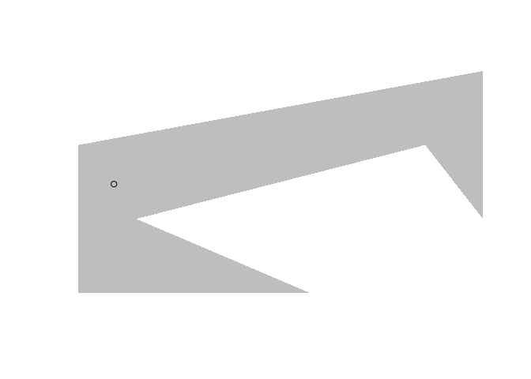

<!-- README.md is generated from README.Rmd. Please edit that file -->

# polylabelr

<!-- badges: start -->

[](https://github.com/jolars/polylabelr/actions/workflows/R-CMD-check.yaml)
[](https://cran.r-project.org/package=polylabelr)
[](https://app.codecov.io/gh/jolars/polylabelr)
<!-- badges: end -->

**polylabelr** is an R wrapper for the [polylabel
package](https://github.com/mapbox/polylabel) from
[Mapbox](https://www.mapbox.com/). It currently contains a single
function, `poi()` that finds the *pole of inaccessibility* of a polygon,
which usually makes for a good place to put a label on a polygon—hence
the name.

## Usage

``` r
# a concave polygon
x <- c(0, 4, 1, 6, 7, 7, 0, 0)
y <- c(0, 0, 1, 2, 1, 3, 2, 0)

# locate the pole of inaccessibility
p <- polylabelr::poi(x, y, precision = 0.01)

plot.new()
plot.window(range(x, na.rm = TRUE), range(y, na.rm = TRUE), asp = 1)
polypath(x, y, col = "grey", border = FALSE)
points(p)
```



## Installation

### CRAN version

``` r
install.packages("polylabelr")
```

### Development version

``` r
remotes::install_github("jolars/polylabelr")
```

## Modifications

The source code from
[geometry.hpp](https://github.com/mapbox/geometry.hpp/) has been
modified slightly by removing the use of some GCC diagnostic pragmas
that caused warnings in R CMD check.

## Versioning

**polylabelr** uses [semantic versioning](https://semver.org/).
