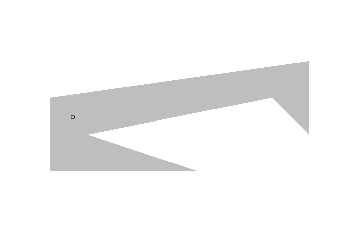

<!-- README.md is generated from README.Rmd. Please edit that file -->

# polylabelr

[](https://travis-ci.org/jolars/polylabelr)
[](https://ci.appveyor.com/project/jolars/polylabelr)
[](https://codecov.io/github/jolars/polylabelr?branch=master)

**polylabelr** is an R wrapper for the [polylabel
package](https://github.com/mapbox/polylabel) from
[Mapbox](https://www.mapbox.com/). It currently contains a single
function, `poi()` that finds the *pole of inaccessibility* of a polygon,
which usually makes for a good place to put a label on a polygon—hence
the name.

## Usage

``` r
# a concave polygon
x <- c(0, 4, 1, 6, 7, 7, 0, 0)
y <- c(0, 0, 1, 2, 1, 3, 2, 0)

# locate the pole of inaccessibility
p <- polylabelr::poi(x, y, precision = 0.01)

plot.new()
plot.window(range(x, na.rm = TRUE), range(y, na.rm = TRUE))
polypath(x, y, col = "grey", border = FALSE)
points(p)
```



## Installation

### Development version

``` r
devtools::install_github("jolars/polylabelr")
```

## Modifications

The source code from [polylabel](https://github.com/mapbox/polylabel)
and [geometry.hpp](https://github.com/mapbox/geometry.hpp/) has been
modified in a few ways to compile properly with c++11 using the standard
flags required by CRAN policies. polylabel has also been modified to
return the distance from the chosen point to the enclosing polygon, in
case it is of value to users.
